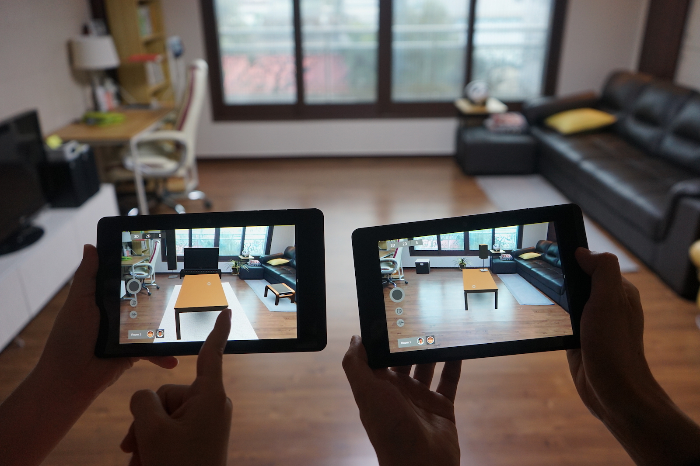

We investigated the use of Augmented Reality for people designing together. We present a design application that runs on multiple synchronized and spatially aware tablets to support couples making interior decisions in and for their future living room. 



Based on the prior art into collaborative design, we suggest a novel design interface that deals with situated design and supports virtual workspaces. 

We asked six couples to design together with our prototype and analyzed their design process, the roles they took, and how they communicated. The results suggest that the social practice of couples designing in and for their home di ers from professional design teams and involves more than just positioning furniture in space. 

We use the design, the prototype and the study to discuss implications for spatial in-situ tools concerning intimacy, collaboration, and design process. The  ndings are useful for future applications that deal with collaborative applications for casual users.
