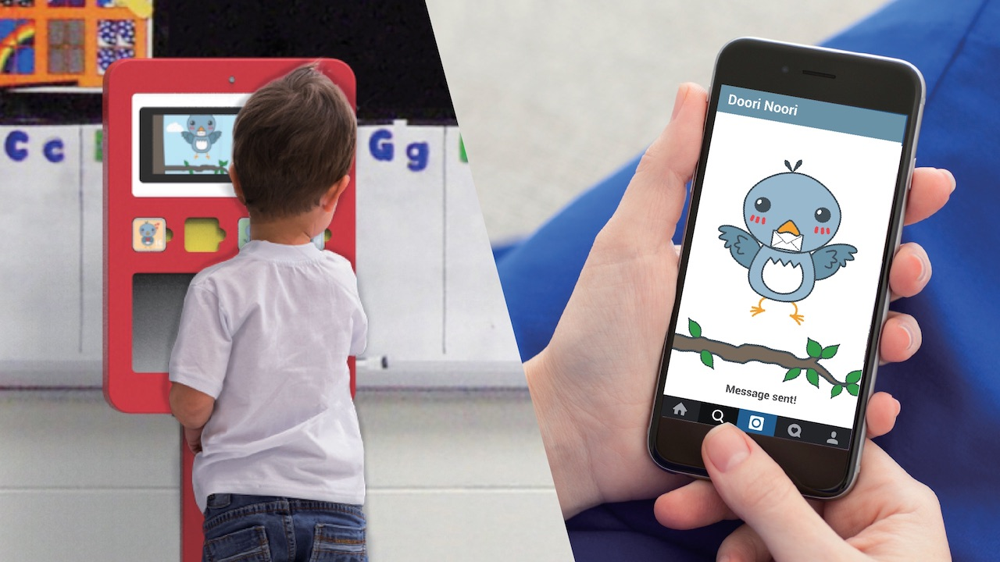

Double income families are on the rise. Parents from these families need someone who can take care of their children while they are at work. This is especially the case for children from two to five years old.

Parents often rely in a guardian or preschool but the latter is the most preferred choice. As a result, children spent most of their day at a daycare center or preschool while their parents are at work. Both, children and parents want to feel emotionally connected during this time.

To this end, Doori Noori is an electronic mail box which allows the transfer of postcards with photographs between children at preschool and their parents at work. Doori Noori consists of a physical device to be placed at the kindergarten which will be printing the messages each child will receive from the parents at work through the Doori Noori mobile phone/PC application.


