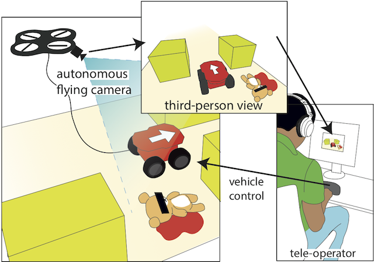
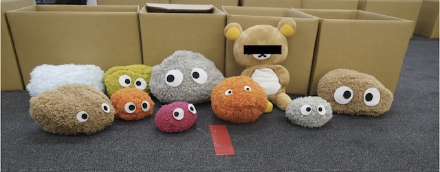

Navigating remote robots and providing awareness of the remote environment is essential in many tele-operated tasks. An external view on the remote robot, a bird’s eye view, is thought to improve operator performance.

We explore a novel designs for providing such a third-person view for a ground vehicle using a dynamic, external camera mounted on a quadcopter. Compared to earlier methods that use 3D reconstruction to create third-person views, the benefit of our approach is a true third-person view through a video feed. We so provide visually rich, live information to the operator.



In an experiment simulating a search and rescue mission in a simplified environment, we compared our proposed design to a pole-mounted camera and to a traditional front-mounted camera. The third-person perspective provided by our flying camera and pole-mounted camera resulted in fewer collisions and more victims being located, compared to the front-mounted camera.

Currently we present simple tethered flying cameras. Future work will include balloon mounted camera for indoor scenarios and extended functionality such as look around and scout.

## Team
Daniel Saakes, Vipul Choudhary, Daisuke Sakamoto, Masahiko Inami and Takeo Igarashi. Thanks to Yoshimasa Furukawa and Koki Toda.
