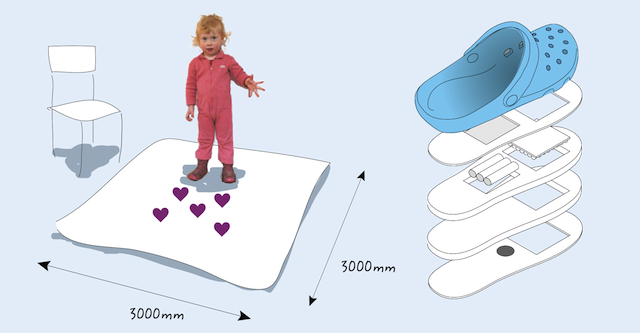
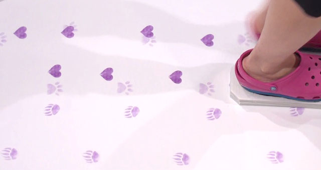



The photochromic carpet is a large size interactive floor display that captures visitors' footsteps in playful prints to make an environment into a canvas of past activities. The implementation consists of a carpet coated with color changing ink and shoes that activate color changes. Each step a visitor makes results in a dynamic print that slowly fades away.

The indoor shoes have custom soles attached with Velcro. The soles have an embedded LED array that operate in near UV wavelengths. The LED array is activated when a step is detected by the build-in accelerometer and pressure sensor.

The floor is painted with a mono-stable light activated ink that temporarily turns dark purple under UV radiation. The shoes activate a color change that stays long enough to create playful patterns.


