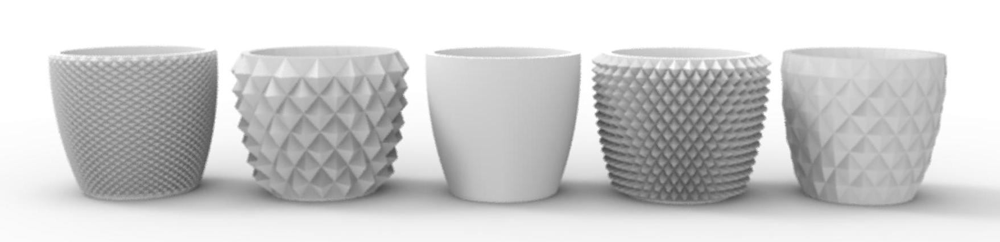
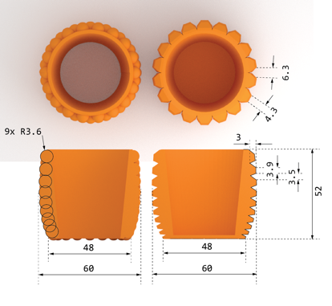
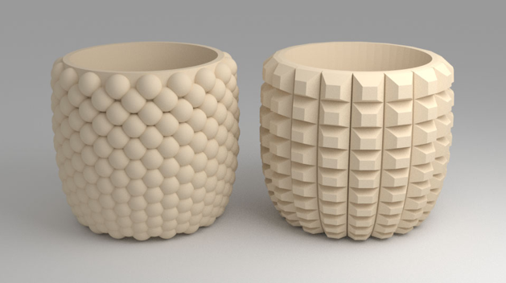
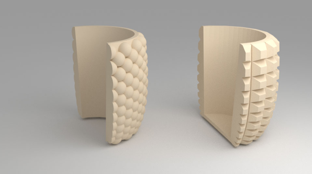
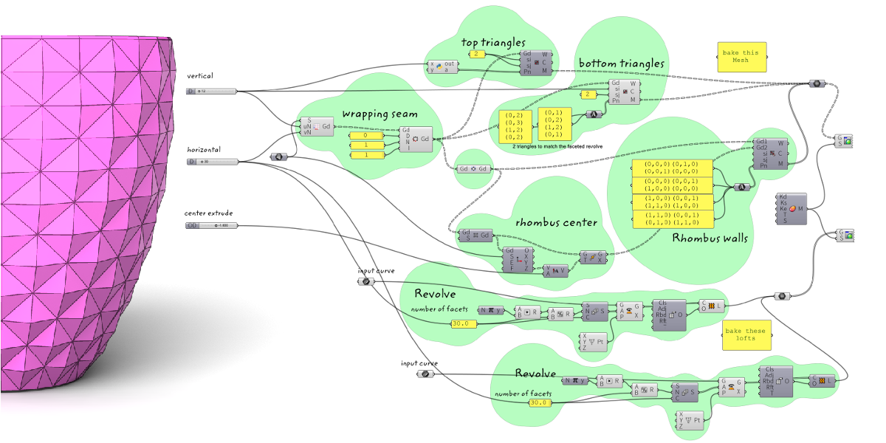

Research shows that design factors of packaging and food containers can have a strong impact on taste experience and product evaluation. However, so far research has mainly focused on how visual appearances steer sensory impressions including smell and taste. 

Taking into account new (technological) developments in packaging design, this research investigates the impact of 3D-printed surfaces on taste evaluation of two ice cream variants. In addition, the interplay between surface textures and matching or non-matching shapes presented on a poster in the consumption environment (i.e., an ice-cream salon) was studied. To this end, 3D-printed cups with either a sharp or smooth surface were manufactured and used in a taste session conducted at an ice-cream salon, where either a poster with sharp or smooth shapes was hanging down the wall. 

Results testify to the potential of influencing taste evaluations by means of surface textures, with a smooth surface enhancing sweetness evaluation, and a sharp surface enhancing intensity evaluations. Furthermore, findings might imply that mismatches between surface textures and poster design may enhance product and taste liking.

