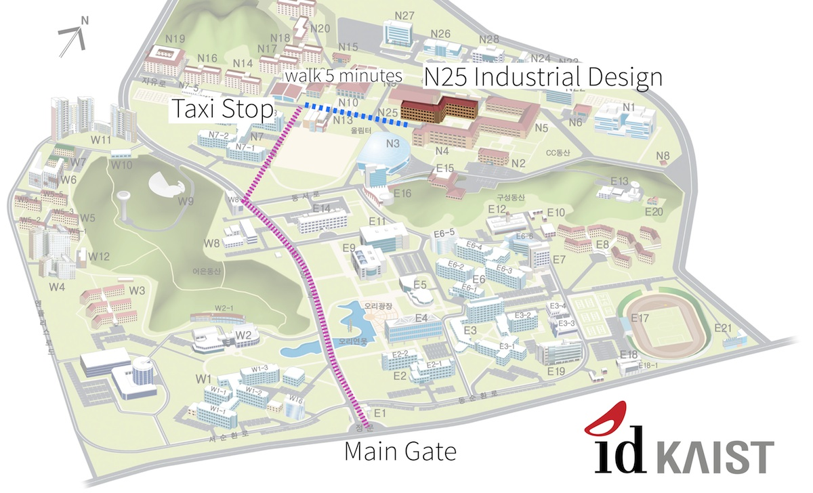

<section class="projects">

<h1>Contact</h1>

  

<iframe width="100%" height="300" frameborder="0" scrolling="no" marginheight="0" marginwidth="0" src="http://www.openstreetmap.org/export/embed.html?bbox=127.35867619514467%2C36.3727270628547%2C127.36490964889528%2C36.3746145747501&amp;layer=mapnik&amp;marker=36.37367082452736%2C127.36179292201996" > </iframe>

We are based at the Department of<a href = "http://id.kaist.ac.kr/"> Industrial Design</a>, <a href="http://www.kaist.ac.kr">KAIST</a> (Korea Advanced Institute of Science and Technology) in The Republic of Korea. <a href="https://www.openstreetmap.org/#map=18/36.37367/127.36179&amp;layers=N">
View a larger map [openstreetmap]</a>

<h2>Address</h2>
KAIST My Design Lab 
Building N25, Room 311 
291 Daehak-Ro Yuseong-Gu 
Daejeon 34141 
Republic of Korea 
tel: +82 (0) 42 350 4565 
Fax: +82 (0) 42 350 4510 
Email: mydesign.kaist@gmail.com 

<h2>How to get to KAIST from the airport</h2>

The KAIST campus is south of Seoul about 1 hour with the high speed train. Many people like the bus (2.5 hours) but most convenient is to take an <a href="http://english.visitkorea.or.kr/enu/TRP/TP_ENG_2_1.jsp">AREX</a> from the airport to Seoul station. From Seoul station take a <a href="http://www.letskorail.com/ebizbf/EbizBfTicketSearch.do">KTX high-speed train</a> to Daejeon. In Daejeon take a taxi to KAIST, or use the subway.
Visit the <a href="http://www.kaist.edu/html/en/kaist/kaist_01070704.html">how to get to KAIST page</a> for more details.

<h2>How to get to our building</h2>

Our building is near the taxi stop in the center of the campus. Show the following to a taxi driver (anywhere in Daejeon)  

카이스트 기계동 택시승강장으로 가주세요. 
(KAIST gigyedong taegsi seung gang jang euro ga juseyo)

</section>

