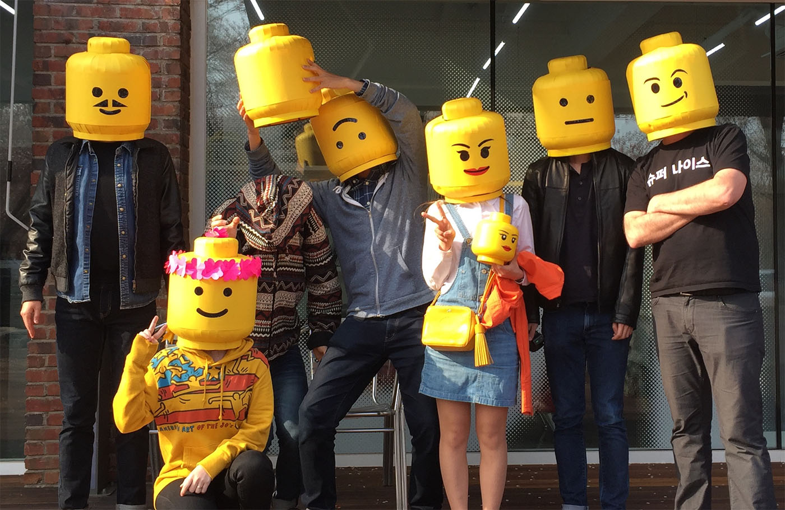

<section class="people">

		 

		 <h1>Meet the team</h1>
		 
		 

			
			

			<a name="{{ member.short }}">
			 

			 
			 <h2>{{ member.name }} / {{ member.title }}</h2>
			
<a href = "http://{{ member.website }}">{{ member.website }}</a>
			<a href = "mailto:{{ member.email }}" >{{ member.email }}</a>

			
{{ member.bio }}
			

			

			</a>

			

	

	

			 

			 <h1>Alumni</h1>
			 

	

			
			

			<a name="{{ member.short }}">
			 

			 
			 <h2>{{ member.name }} / {{ member.title }}</h2>
			 
			
<a href = "http://{{ member.website }}">{{ member.website }}</a>
			<a href = "mailto:{{ member.email }}" >{{ member.email }}</a>

			
{{ member.bio }}
			

			

			</a>

			

	

	

			 

			 <h1>Alumni Researchers and Interns</h1>
			
Anthony Wilson (2017 - Spring 2018)

			
Woojae Kang (Winter - Spring 2018)

			
Jinyoung Jeong (Winter - Spring 2018)

			
Alex Calero (February 2018)

			
Minkyeong Lee (2016) <a href="/projects/consumer_to_creator">Consumer to Creator</a>

			 
Sumin Jang	(Summer 2016)	Visualizing Furniture Layouts in AR

			 	
 Jaewoong Han	(Spring 2016)	3D Printing and Mold Making

			 			 
Tetiana Parshakova	(2015 - 2016) <a href="/projects/ratchair">RatChair</a>

			 			 
Sangyeob Lee	(Summer 2015)	Interactive Camera System Interface

			 			 
Seoyoung Baek and Joonhee Min	(Summer 2015)	Surface Texturing in 3D Printing

			 			 
Alex Balio and Sam Ukolov	(2014 - 2015)	Painting Drone

			 			 
Felix Shin	(2013 - 2015) <a href="/projects/tag_radar">Tagradar</a>

			 			 
Hayeon Jeong	(Winter 2013) <a href="/projects/i_eng">I-Eng</a>

			 

	

</section>

<section class = "join">
 

  

    <h1>Join My Design Lab</h1>
    
We are always looking for new students and partners. Please <a href="/contact/">contact us</a> for more information.

   

</section>
