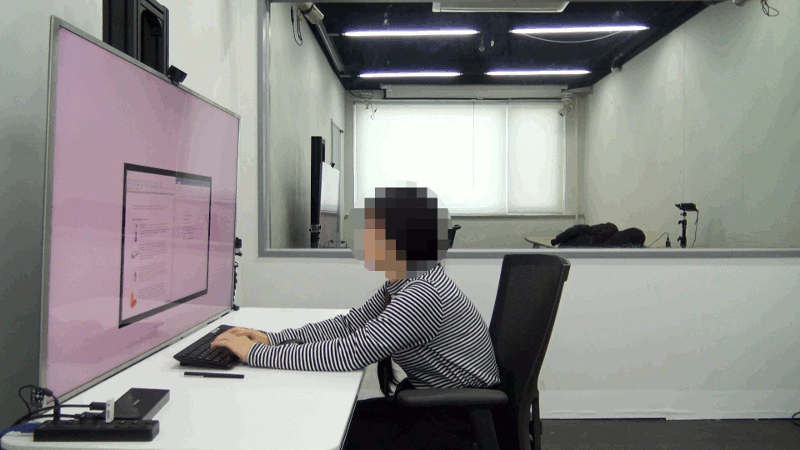

   Study

The position and orientation of a monitor affects users’ behavior at
their desk. In this formative study, we explored and designed four types
of interactions between an actuated monitor and a user to induce posture
changes.

.. figure:: img/behaviors.png
   :alt: Behaviors

   Behaviors

We built a virtual monitor that simulates the motions of an actuated
monitor and slowly moved in the opposite direction of unbalanced sitting
postures. We conducted an explorative study with eight participants. The
study showed participants’ responses and step by step posture changes
toward balanced sitting postures. We share considerations for designing
monitor actuations that induce posture intervention.

.. vimeo:: 259105776

.. figure:: img/formative.gif
   :alt: Formative study

   Formative study

As a first step we play-acted the actuated monitor in a Wizard-of-Oz
style formative study. A researcher hid behind a fake wall and moved the
monitor to gain a basic understanding how monitor motions induce posture
changes.

.. figure:: img/setup.png
   :alt: The setup

   The setup

Then we simulated a monitor on a large 4K screen. The virtual monitor
moves horizontal and vertical, and rotates. Through scaling we simulated
movement towards and away from the user. Again, we used Wizard-of-Oz to
move the virtual monitor. Our next step will be to build a real actuated
monitor and include 4 degrees of freedom, 3 axis and 1 rotation.

