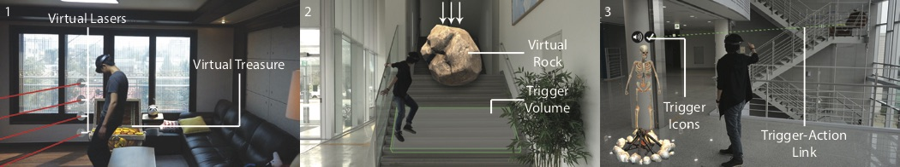

   Game Level Editor

Level editors let end-users create custom levels and content within a
given video game. In this paper, we explore the concept and design of
Augmented reality game level editors. These new types of editors are not
only spatial and embodied, but also situated, as they enable users to
tailor games to the unique characteristics and emotional value of their
own space.

.. vimeo:: 259625888

We present the design and implementation of a prototype level editor
that runs on the Microsoft HoloLens. The editor enables users to add
virtual content in their homes and add interactions through spatial
trigger-action game-logic programming.

We had pairs of students create games with the prototype and play each
other’s games. They reported that games are fun to make, play, and watch
others play. Based on the design and evaluation, we propose guidelines
for Augmented reality game-authoring tools for end users.