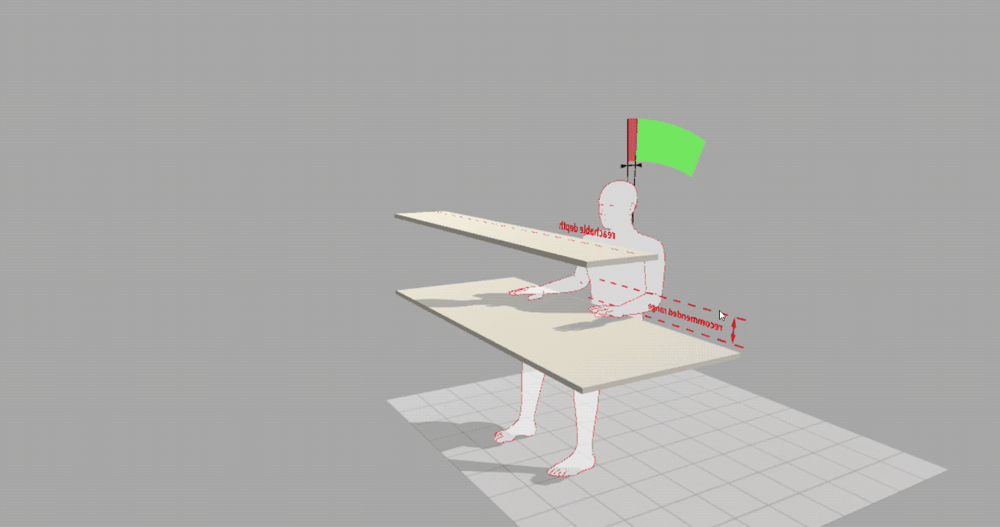
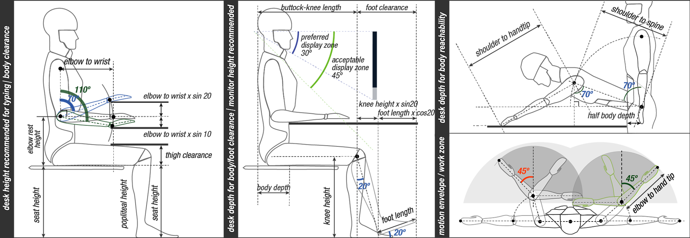
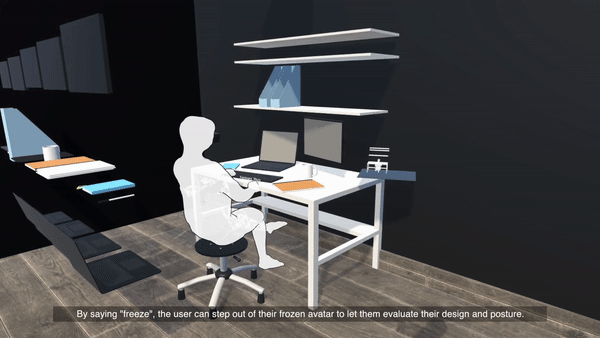
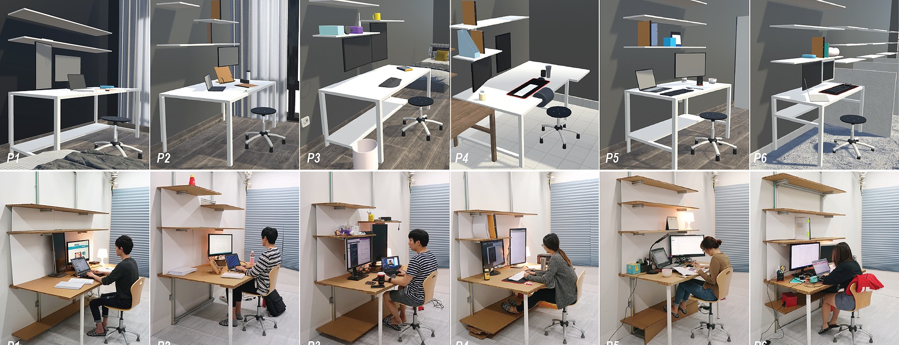

We explored the application of *human factor* guidelines in personal
fabrication. This is useful for several Do-It-Yourself (DIY) scenarios,
including users adjusting their tabletop height or designing a desk to
fit a single person. We identified a dependency map between the user’s
anthropometrics, ergonomic pose recommendations, and design dimensions.

   Interactive Dependency model

   Dependency map

Based on this, we developed situated and interactive guidelines to
assist users in design applications. We applied these guidelines in a
Virtual Reality (VR) system that lets users customize their desk and
provides real-time feedback and feedforward on pose and design. We
evaluated the system with six participants, had each one design a
personal desk, fabricated their desks, and let them work on the desks
for four hours. The design and evaluation contribute to fabrication
tools as it helped users be aware of their pose and ergonomic knowledge,
and be able to design for their bodies and needs.

   The virtual Reality tool: body2desk

   The custom desks as a result of the user study

.. vimeo:: 262968103