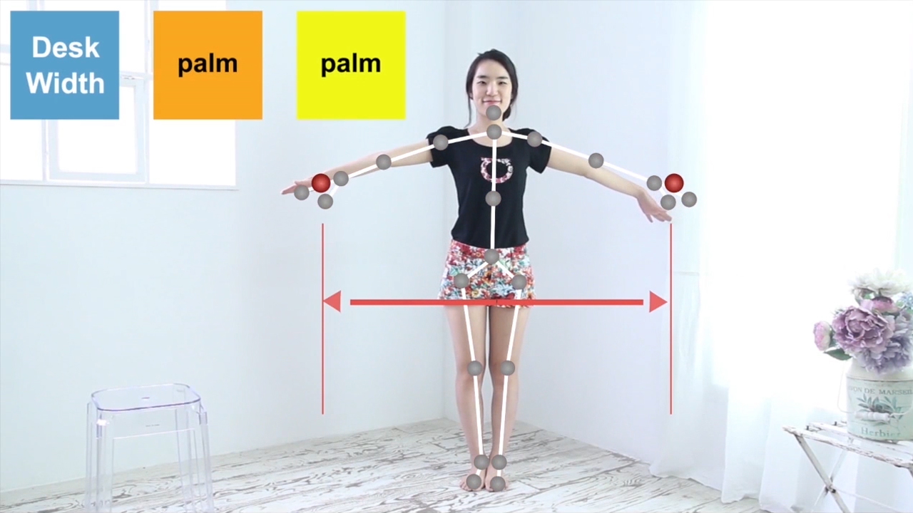
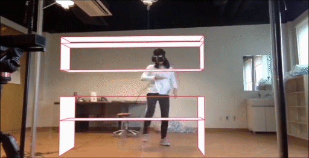

Digital fabrication is becoming increasingly practical for customizing products to users’ specifications. However, the design interfaces for customizing items have focused more on 3D modelling and less on how people use the object or how it fits around their body. 

	
	

BodyMeter is a user-centered approach where posing and acting is input for personalizing furniture. Users specify dimensions by referring to their body parts and using simple speech commands such as “this wide” or “from here to here”, while indicating a distance with their arms. A head-mounted display (HMD) provides instant feedback in real-size and allows users to experience and evaluate their virtual design as though it were a prototype. We report the formative and evaluative studies that indicate that the proposed approach engages casual users in the iterative design process of personalizing items in relation to their use, body, and environment.


