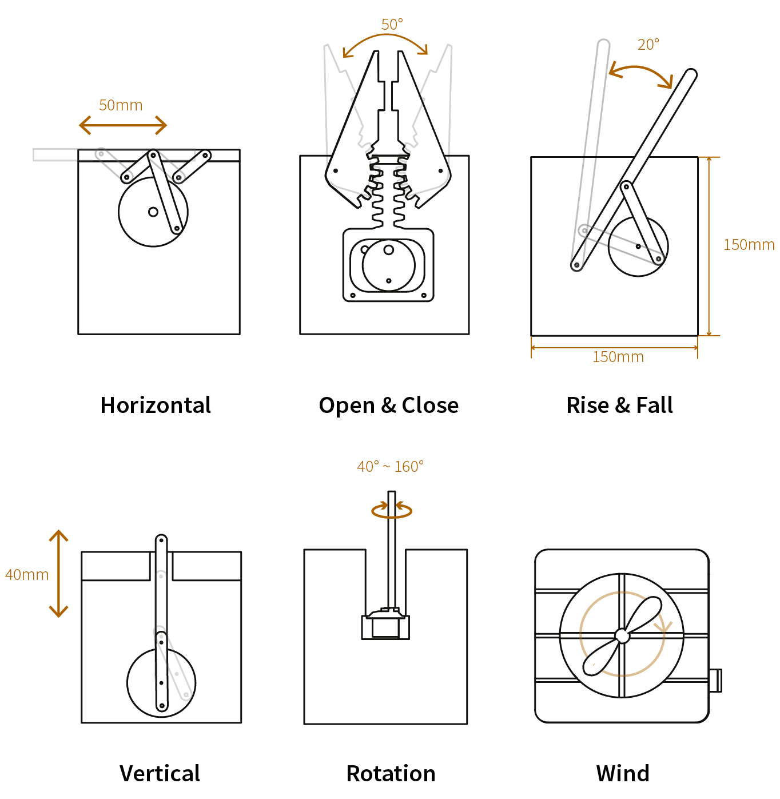

The abundance of information technology in today’s society results in “Alert Fatigue” due to the overwhelming number of alarms and notifications that attempt to grab our attention.

We introduce Calm Automaton, a customizable and programmable physical display that gently visualizes abstract data in a pleasing and meaningful way, without attracting attention. We extend the concept of calm technology with a DIY toolkit to make information and notifications comfortable, personal, and embedded in the periphery.

The design process to make a personal display consists of two steps. First make a design, select motion modules and attach artwork. Then animate the modules by mapping states (e.g. sunny, clouded, rain) to positions.

We designed 6 motion modules. Each automaton can house three modules.

	
	
	
	
	

	We describe the design and implementation of the motion modules that make the automaton and report on the experience of people using these displays.


