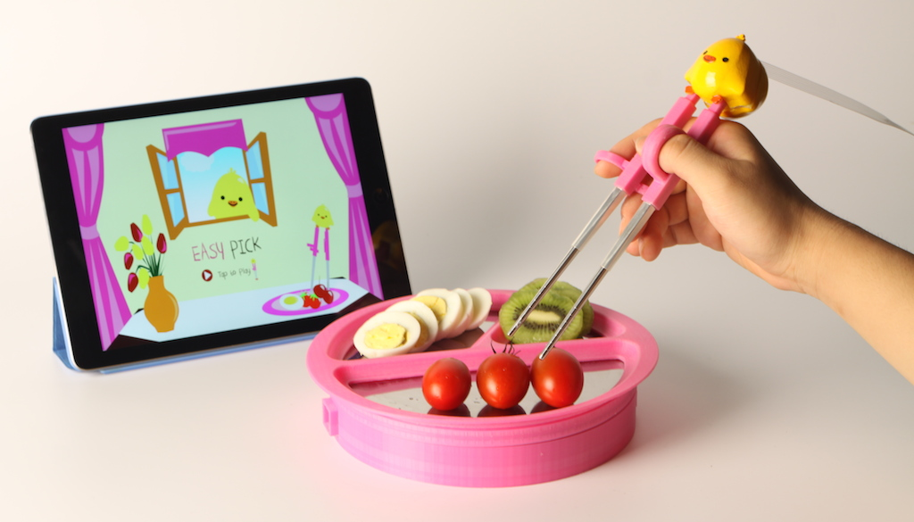
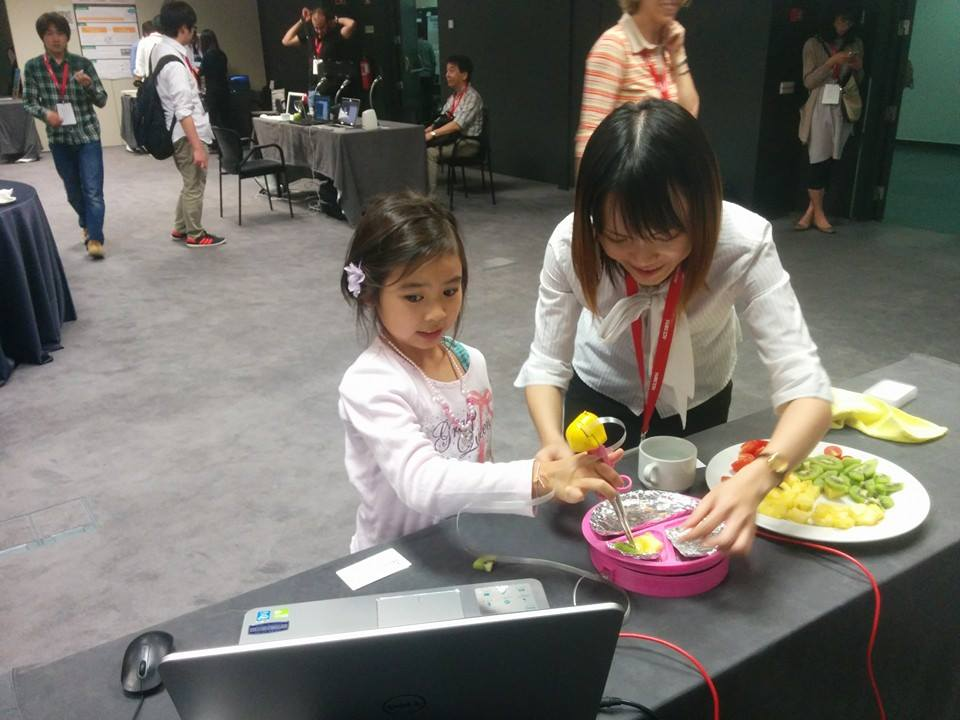

Handling chopsticks requires fine motor skills that are challenging to
master. We present interactive training chopsticks that help children
develop fine motor skills and eye-hand coordination that are needed for
eating with chopsticks. We implement two games that use the chopsticks
as a controller for an augmented mirror application to guide children
through the required hours of repetitive practice in the process of
learning chopsticks.

Various sensors are embedded in the interactive chopsticks to capture
user behavior by detecting number of actions : chopsticks touch food on
each of the sections of the plate; chopstick tips touch together; and
chopstick tips touch the user’s mouth.

