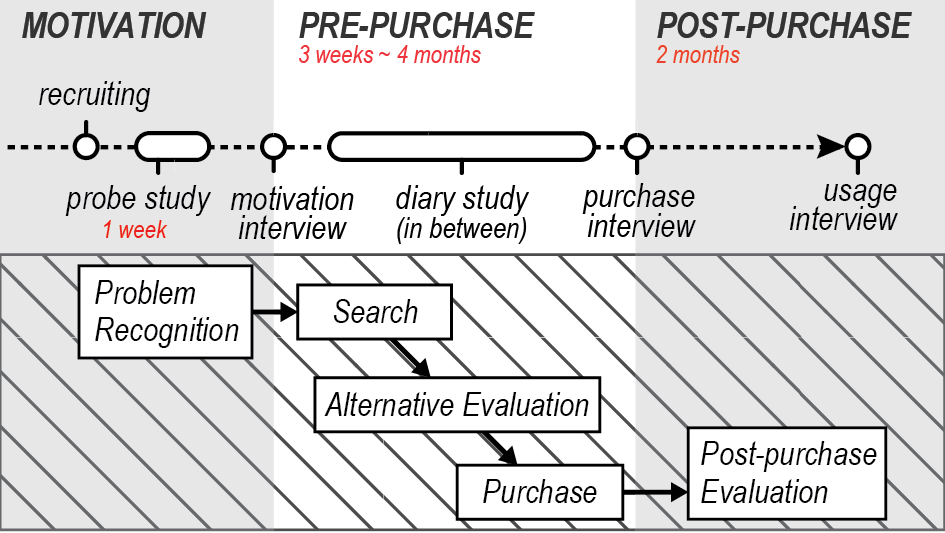
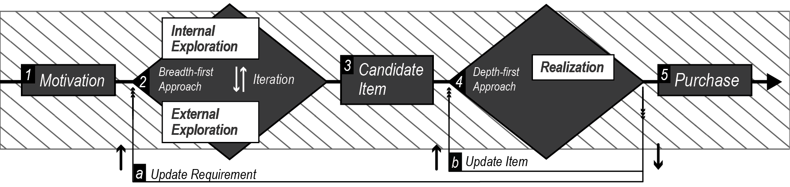

Emerging technologies for digital design and fabrication let people participate in the making of objects that were previously dominated by professional designers. A growing body of work in HCI provides understanding in the activities of designing and making by novices and in maker communities. However, we know little about how casual users might employ these technologies with the goal of having an object in their home that satisfies a need. We present a long-term qualitative study in which we followed 16 households during a purchasing process of furniture items for their homes. 

We looked into how families discover what they need, find solutions, realize a solution in their house and put it to use. The results provide insights into their design activities and workflow and we identify two distinct stages: understanding needs and prototyping a solution. Based on the findings, we discuss the social practice of acquiring and appropriating furniture in the home and within families, and identify design opportunities for digital design and fabrication to support people as they create the objects they need, want and desire. 

 

<iframe src="https://player.vimeo.com/video/204833663" width="100%" height="500" frameborder="0" webkitallowfullscreen mozallowfullscreen allowfullscreen></iframe>

**Publications** 
<ul>
	<li>Bokyung Lee, Gyeol Han, Jundong Park and Daniel Saakes.
	 <a href="http://chi2017.acm.org/"> Consumer to Creator: How households buy furniture to inform design and fabrication interfaces</a> <i>CHI'17</i>. Accepted.</li>
	<li>Jundong Park, Bokyung Lee, Gyeol Han, Daniel Saakes.
	 <a href="http://conference.hcikorea.org/hcik2017/">미래의 패브리케이션 인터페이스를 위한 두 가지 디자인 프로세스 사고 과정 Two Mental Models of Non-Professional Design Process for Future Fabrication Interface</a>. <i>HCI Korea 2017</i>. Accepted. [<a href="../../publications/files/2017_ctc_hcik.pdf">pdf</a>]</li>
 </ul>
 
  