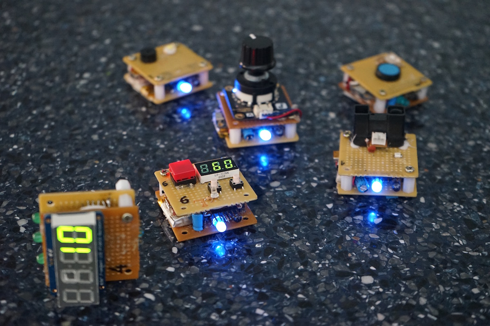

Latest hardware improvements on transceivers supporting Low PowerWide Area Networks (LPWAN) make it feasible to connect small battery powered devices hundred of meters or even km away. In this paper, we propose a physical computing paradigm fully exploiting this novel technology. Spatial physical computing (SPC) leverages not only natural manipulation typically used on TUI and construction kits but also integrates the necessary deambulation (around a building or a city) in the process of creating, testing and tuning a distributed smart sensor/actuator network. The overall system is a compound of (an unlimited) set of independent data-processing nodes supporting an event-driven data-flow programming scheme. We demonstrate in a few examples how such networks can be deployed - spatially programmed - through intuitive physical actions, and discuss the unique qualities and challenges of Spatial Physical Computing. 

  

<iframe src="https://player.vimeo.com/video/204834445" width="100%" height="500" frameborder="0" webkitallowfullscreen mozallowfullscreen allowfullscreen></iframe>

**Publication** 
Alvaro Cassinelli and Daniel Saakes. <a href="http://tei.acm.org"> Data Flow, Spatial Physical Computing.</a> <i>TEI 2017 </i>. Accepted. [<a href="files/2017_gluons.pdf">pdf</a>] 

 