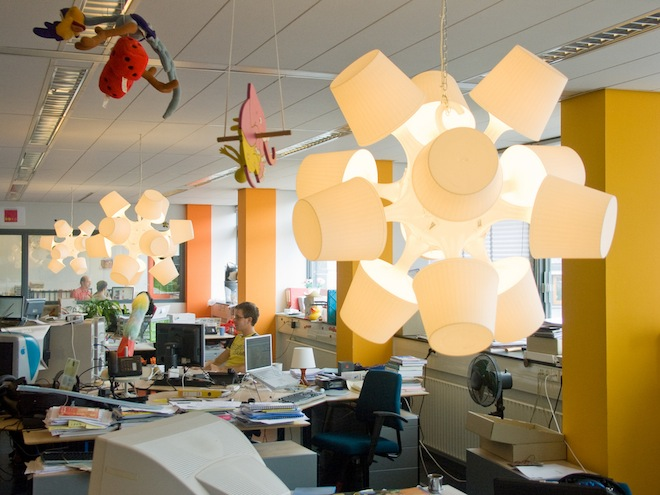
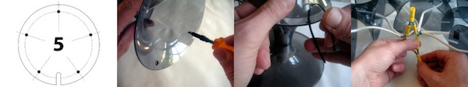
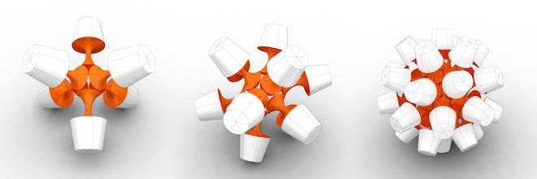
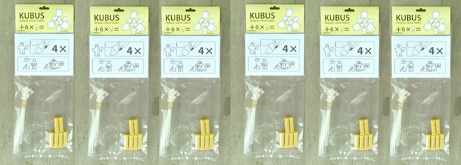

   Lamps in Action

In 1973 Jim Hennessey and Victor Papanek published Nomadic Furniture a
book filled with inspirational guides for end users to fabricate
everyday furniture. Today, instead of using raw materials, we save time
and skill by repurposing existing products such as those from IKEA. Big
Lampan Lamps is an Ikea Hack for making a chandelier out of many small
Ikea lamps.

   process

The designs are based on platonic volumes to balance optimal lamp/sphere
packing with ease of manufacturing. The cube consists of six lamps, no.
12 has twelve lamps on the faces of a dodecahedron. No. 32 has a lamp on
each face of a truncated icosahedron.

   versions

Instructions are posted on the `instructables`_ website. Lamps are
connected with tie-wraps and all the wires are connected to a single
plug.

   lampan lamps on sale

A DIY kit for the no.6 that contains the manual, the template and the
fasteners. Just add 6 lamps. A token of appreciation given to new
subscribers of the bright magazine

.. figure:: img/no92.jpg
   :alt: 92 lamps version

   92 lamps version

The biggest and the baddest lamp is no 92. Larger it cannot get, because
the base of a lampan is smaller than it’s shade. The total diameter of
no. 92 is only 140 cm by approximation. Made in Delft with Aadjan van
der Helm and Walter Aprile.

.. _instructables: http://www.instructables.com/id/Big-lamps-from-Ikea-lampan-lamps./