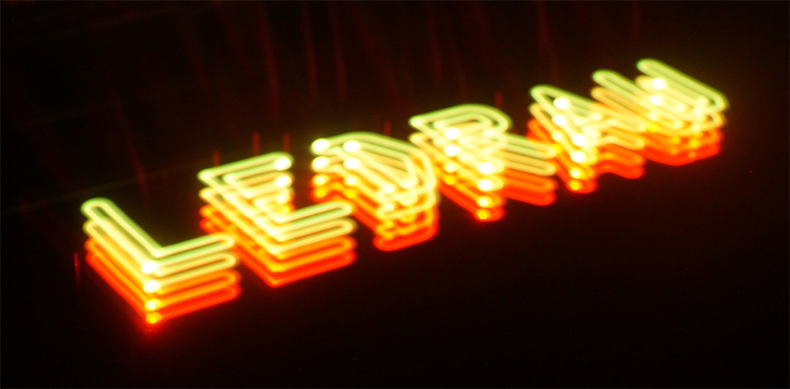

LEDraw is a light drawing module based on long time exposure photography. By using the LEDraw module, you can draw 2D and 3D images using light.

LEDraw uses long time exposure photography, which is similar to some traditional nighttime camp activities. However, these types of images are typically quite rough and mono color. By combining the <a href = "http://www.axidraw.com/" target = "_blank">Axidraw</a> and the LEDraw module, clean, multi-color images can easily be created by anyone, regardless of experience. The LEDraw module contains a depth controller and <a href = "https://www.adafruit.com/category/168" target = "_blank">Neopixels</a>, which are used for light drawing. The depth controller changes the depth of the Neopixel and is used for 3D drawing.

<iframe src="https://player.vimeo.com/video/183784187" width="100%" height="500" frameborder="0" webkitallowfullscreen mozallowfullscreen allowfullscreen></iframe>
 

