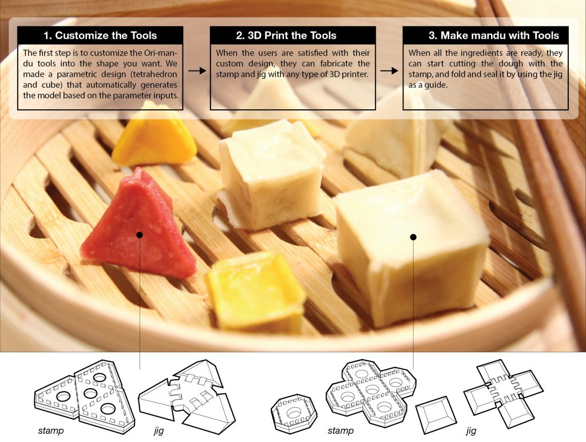

Food 3D printing is getting the spotlight by offering the opportunity to customize food appearances, textures and flavors that are troublesome to make by hand. Additive manufacturing machines extrude ingredients into a certain shape, however, they cannot be applied to all types of food, such as for Mandu (Korean dumpling). We propose a novel and hybrid process in which we fabricate custom tools that assist the process of cooking. To assist in the mandu-making process, we present a stamp and jig system. Computer-aided design (CAD) software generates these tools based on the user’s parameters, then the user cuts the dough with the stamp and folds the dumpling using the jig. The user can make mandu into various geometric shapes quickly without any special skills. In the following pages, we documented our process of designing Ori-mandu. 

  

<iframe src="https://player.vimeo.com/video/209689013" width="100%" height="500" frameborder="0" webkitallowfullscreen mozallowfullscreen allowfullscreen></iframe>

**Publications** 
<ul>
	<li>Bokyung Lee, Jiwoo Hong, Jaeheung Surh and Daniel Saakes. <a href="http://dis2017.org/"> Ori-mandu: Korean Dumpling into Whatever Shape You Want</a> <i>DIS Pictorial 2017</i>. Accepted. [<a href="files/2017_ori-mandu.pdf">pdf</a>]</li>
	<li>Bokyung Lee, Jiwoo Hong, Jaeheung Surh and Daniel Saakes. <a href="http://chi2017.acm.org/"> Ori-mandu: Korean Dumpling into Whatever Shape You Want</a> <i>CHI Video Showcase 2017</i>. Accepted.</li>
</ul>
 