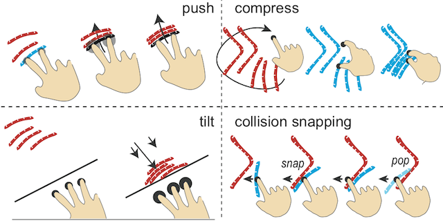

Many objects that we daily use such as furniture and clothing, start as flat material on sheets or in rolls. Computer numerical control (CNC) fabrication devices cut these materials into multiple 2D parts that make up 3D objects.



The material inside a lasercutter is captured by an overlooking webcam (a) mounted in the lid. By fabricating callibration patterns with the laser cutter we establish the relationship between the camera image and lasercutter coordinate system. Once calibrated, users simply take a picture (b) with the attached buttons. We also report of a precise method using the lasercutter preview laser as a scanner. A cheap photodiode (c) measures the reflection (d) of the preview laser and so the presence of material is related to a position x,y of the toolhead.

The captured material functions as a constraint in the interactive user interface to make an overlap free layout. The interface is based on observation how people pack parts and based on earlier work in snapping and physics on the desktop. In a 2D rigid body simulation, selected parts collide, reorient and slide to other parts, but do not move other parts. Several interactions are explored such as push to move parts, compressing a selection, moving all parts to a side of the table.

## Team

Paccam is made in Tokyo in collaboration with Thomas Cambazard (EPFL), Jun Mitani (Tsukuba University) and Takeo Igarashi (University of Tokyo).
