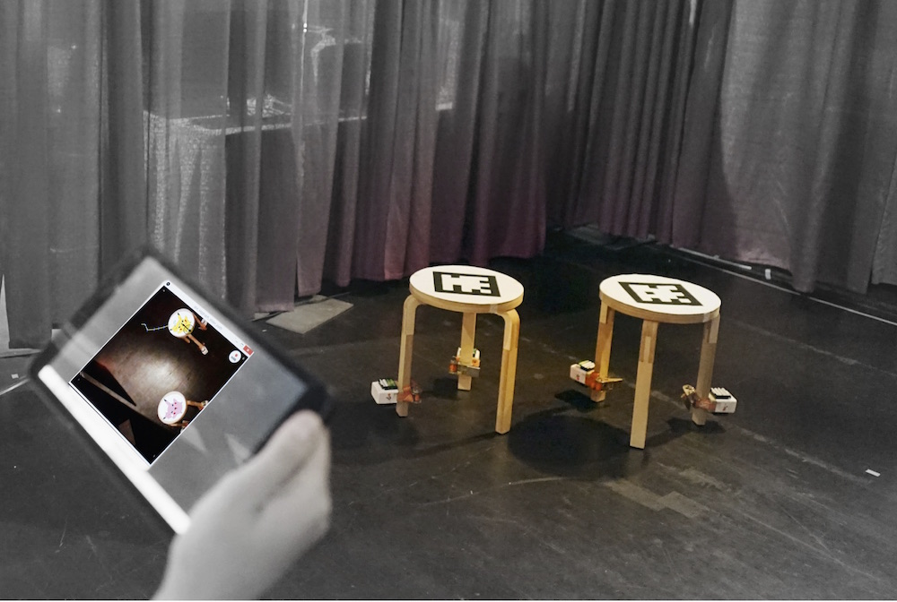

RatChair a strategy for displacing big objects by attaching relatively small vibration sources. After learning how several random bursts of vibration affect its pose, an optimization algorithm discovers the optimal sequence of vibration patterns required to (slowly but surely) move the object to a specified position.

	
	
	

 
We designed sources of vibration that can be easily attached to furniture and objects. Embedding vibration modules as part of mass-produced objects may provide a low-cost way to make almost anything mobile. The principle is agnostic with respect to the shape of the object, number, type, or relative position of the actuators. 
 

<iframe src="https://player.vimeo.com/video/164654647" width="100%" height="500" frameborder="0" webkitallowfullscreen mozallowfullscreen allowfullscreen></iframe>

 

	
	

 
Using indoor tracking, the user could reconfigure furniture in a room.

**Publication** 
Tetiana Parshakova, Minjoo Cho, Alvaro Cassinelli and Daniel Saakes. Ratchair: Furniture learns to move itself with vibration. <i>SIGGRAPH 2016 emerging technologies</i>. [<a href="../../publications/files/2016_ratchair.pdf">pdf</a>] 

**Demos** 
<a href="https://www.dcexpo.jp/en/">Digital Content Expo</a>, 27 October 2016 - 30 October 2016. Tokyo, Japan 
<a href="http://s2016.siggraph.org/content/emerging-technologies">SIGGRAPH 2016 Emerging Technologies</a>, 24 July 2016 - 28 July 2016. Anaheim, California, USA 
<a href="/2015/10/11/Maker_Faire_2015/">Maker Faire Seoul 2015.</a> 10 October 2015 - 11 October 2015. Seoul, Republic of Korea 

	

