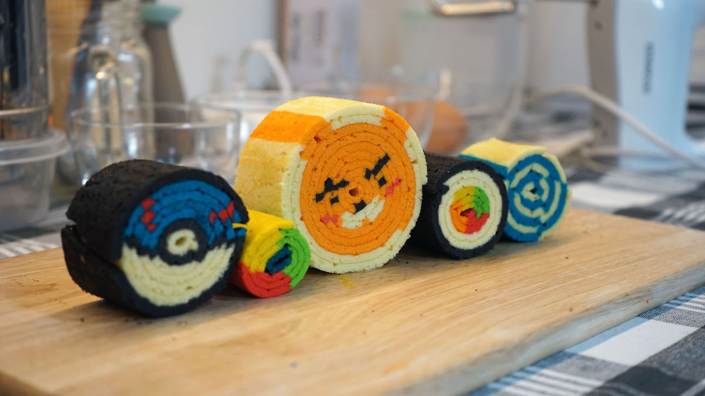
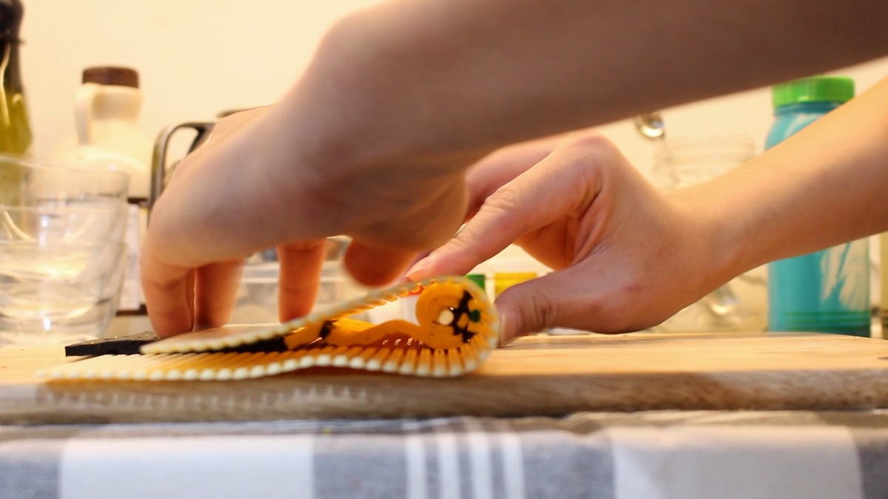
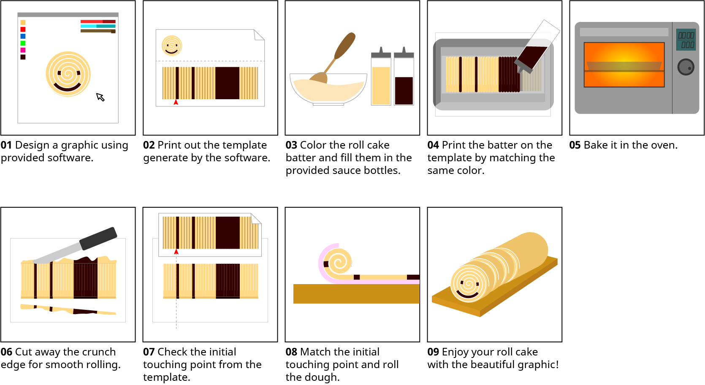

   Rolling Graphics

Food fabrication offers a new dimension to home cooking. We see the
design challenge not in automating cooking tasks, but in augmenting the
tangible experience, skill building and enjoyment of baking. As an
example of such augmentation, we present a novel concept for designing
and fabricating roll cakes with custom cross-section graphics.

.. vimeo:: 259104890

Roll cakes are made by rolling a flat piece of cake into a spiral. In
our application, users draw the cross section image of their cake and we
calculate a printable template as a guide to color the unrolled cake.
Users mix colored batter and use a custom 3D printed nozzle to arrange
the batter on the template.

   Rolling rolling rolling

After baking the batter in the oven, users simply roll it into a roll
cake and magically their design is shown on the cross-section.

We identified and solved the key difficulties in making graphics such as
a consistent layer thickness and aligning the graphics in the spiral.
With Rolling Graphics, we expand the potential of food printing with
custom graphics and potentially, custom tastes.

   How to roll