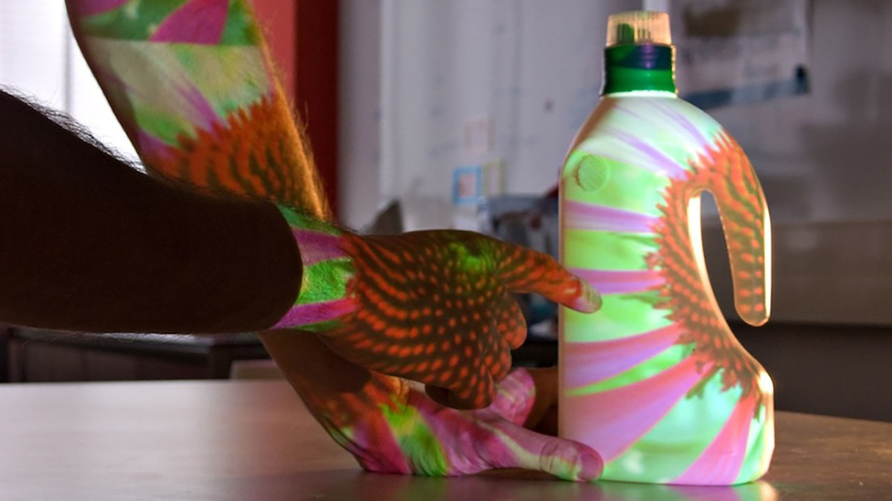

Skin applies Projected Augmented Reality to effectively and rapidly
explore the first ideas for new products. `Material Design Workshop`_ is
a workshop format developed around the Skin design tool.

.. vimeo:: 1378174

Material Design Workshops makes use of the existing materials designer’s
have. Their collection of digitial materials and collections of material
samples and example products. The tool Skin supports mapping materials
onto product prototypes to make the interactions between shape and
materials experiential.

Material Design Workshop consists of three steps. Prior to the workshop,
materials are collected in the collecting step. In the generating step
new ideas are generated. In the review step, an interactive wall display
lets participants group their concepts.

Tracking and locating objects is important in many situations. TagRadar
provides an approach to locate items with RF and a single radio that
does not require a prepared space with beacons or similar technology.

.. _Material Design Workshop: http://www.studiolab.nl/skin/

