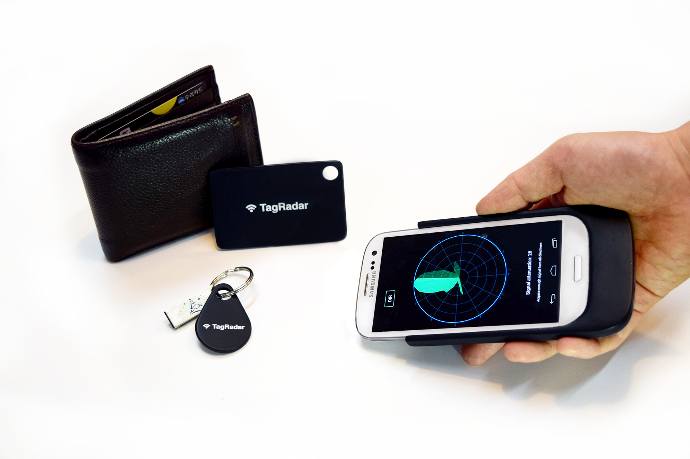

TagRadar is a smart phone accessory that helps users to locate objects with radio frequency tags. We employ a directional antenna and combine signal strength readings with headings obtained from the compass of the smart phone.

While scanning a space by waving the smart phone, the aggregated data is presented on an on-screen polar graph that dynamically reveals the most likely heading of the target object. A user test showed that users favor TagRadar and that it is both faster and has a higher accuracy compared to using only signal strength.

.. vimeo:: 138178621

Tracking and locating objects is important in many situations. TagRadar provides an approach to locate items with RF and a single radio that
does not require a prepared space with beacons or similar technology.

