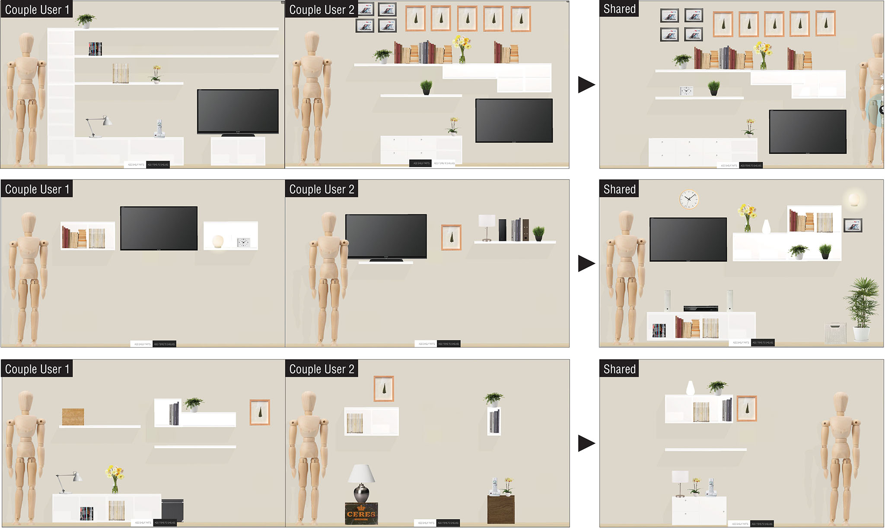
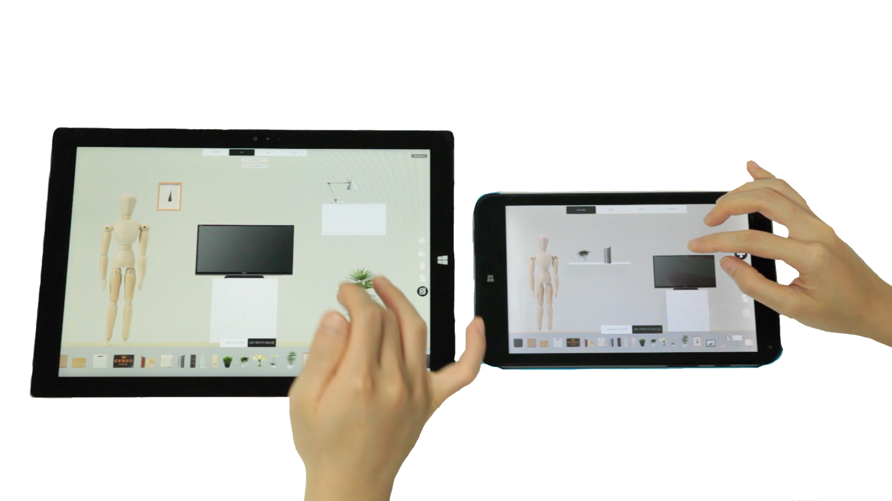

Although many decisions in the home are made together, between partners and within families, most digital applications for interior design are geared towards single user operation. In this paper, we present the results of a first look into how couples design together and how that is different from how professional designers collaborate in teams. Based on prior art in collaborative design, we developed a shelf design application, TwoShelves, that runs on multiple and synchronized tablets and includes a projector that projects the design real-time and real-scale in the living room.



We asked pairs of participants to design with the application using two tablets in a single shared design space and using two tablets with both private and shared design spaces. The initial results with three couples in their homes reveal how they design together which might help future design applications for at home.

