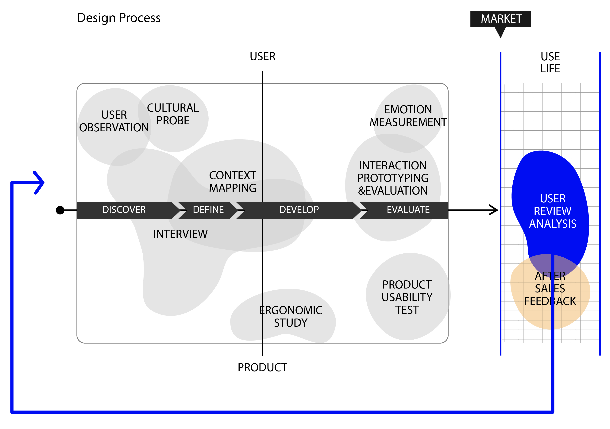
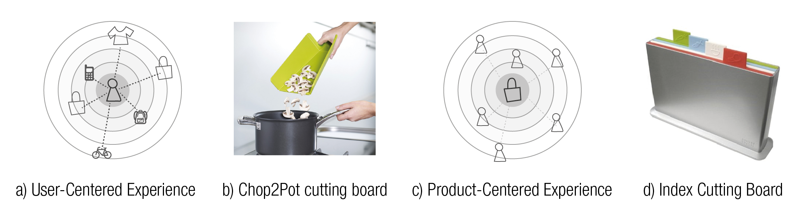

User-centered design processes are comprised of several methods and are
deployed to gain insights about user needs and experiences. Many of
these methodologies require qualitative studies with small groups of
users based on set guidelines and are time and resource intensive. We
propose a new technique: “User Review Analysis” that makes use of big
data to uncover user needs. The technique consists of collecting and
analyzing online User Reviews on shopping sites such as Amazon.

.. figure:: img/study_2.jpg

The basic idea is that because of the fast and cyclic nature of consumer
products development, reviews of Today’s products inform designers on
the next product generation. As the data is based on actual product-use
experience with similar products, the aggregated insights provide
product-in-use experience and brings to light several product design
aspects and complement the existing methods.

The ideation sessions indicate the potential of the method and that
designers benefit from including User Review Analysis in a design
process, specifically when used in conjunction with other methods, as
its informational characteristics are complementary.

